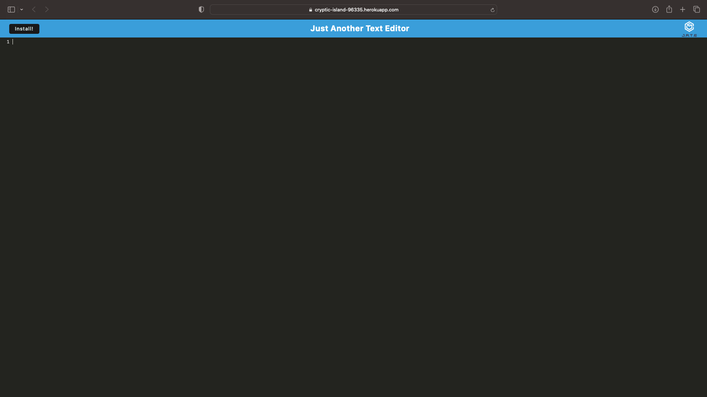

# text-editor

[Deployed Application](https://cryptic-island-96335.herokuapp.com)

## Description

This code was designed as a text editor.

## Table of Contents

- [Installation](#installation)
- [Usage](#usage)
- [Credits](#credits)
- [License](#license)

## Installation

Press the "Install" button at the top of the page.

## Usage
Type into the numbered lines and it will store your text.

  
 

## Credits

Starter code provided by: 
Xandromus at https://github.com/Xandromus 
GitHub repository: https://github.com/coding-boot-camp/cautious-meme

## License

MIT